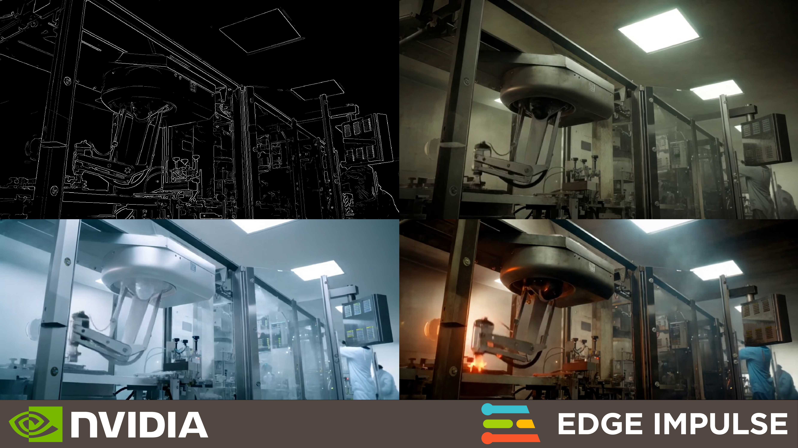
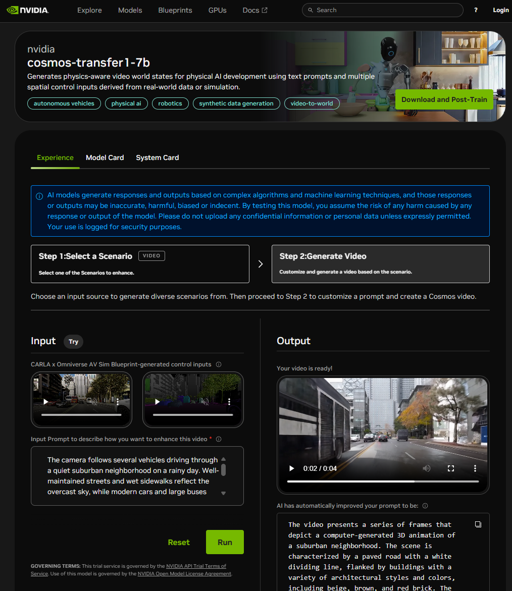
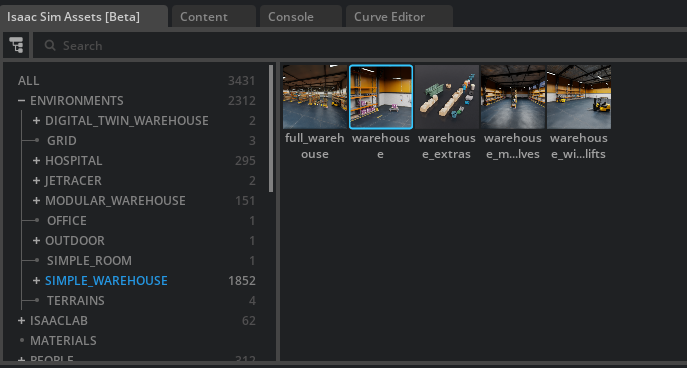
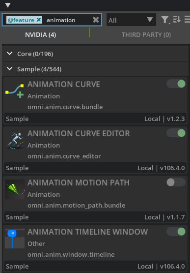
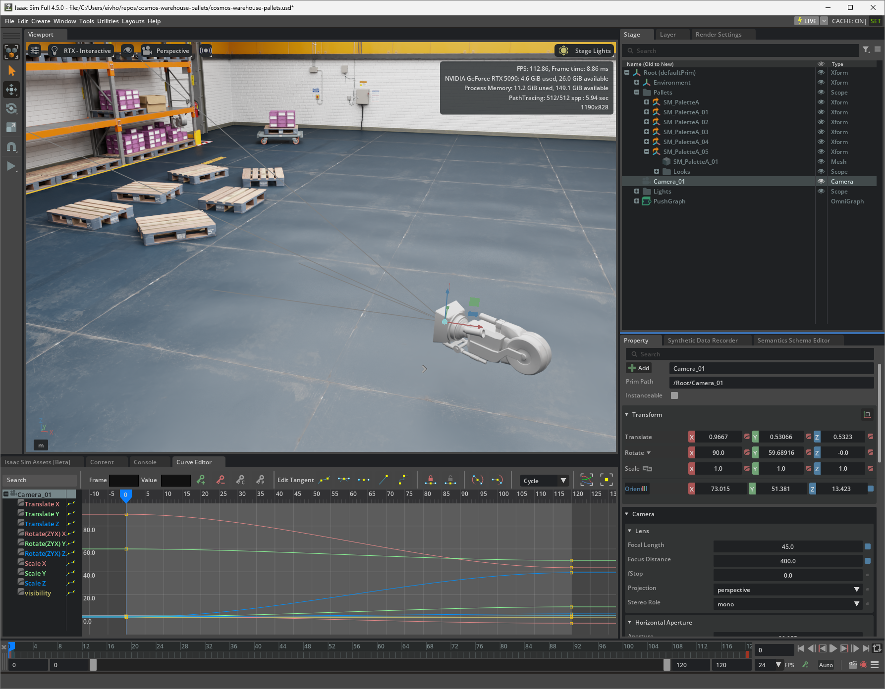
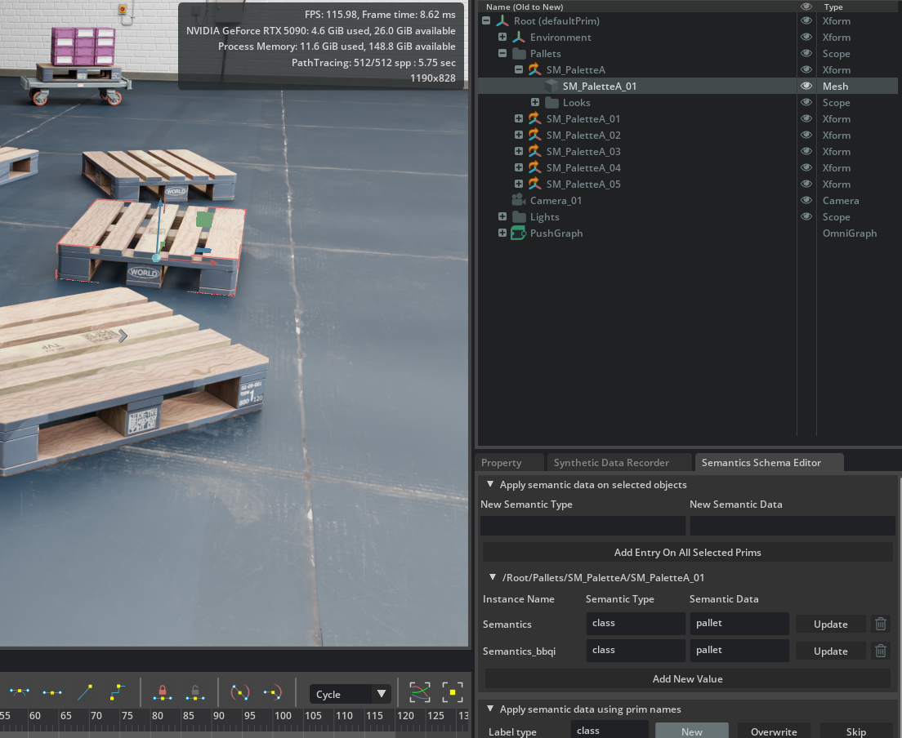
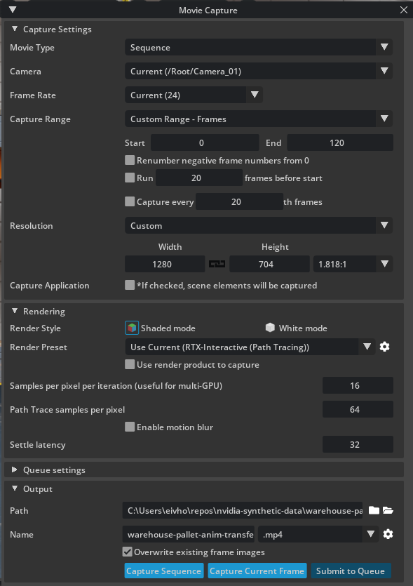
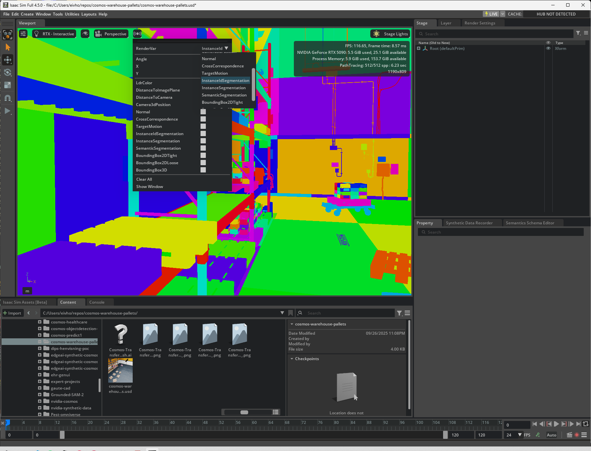
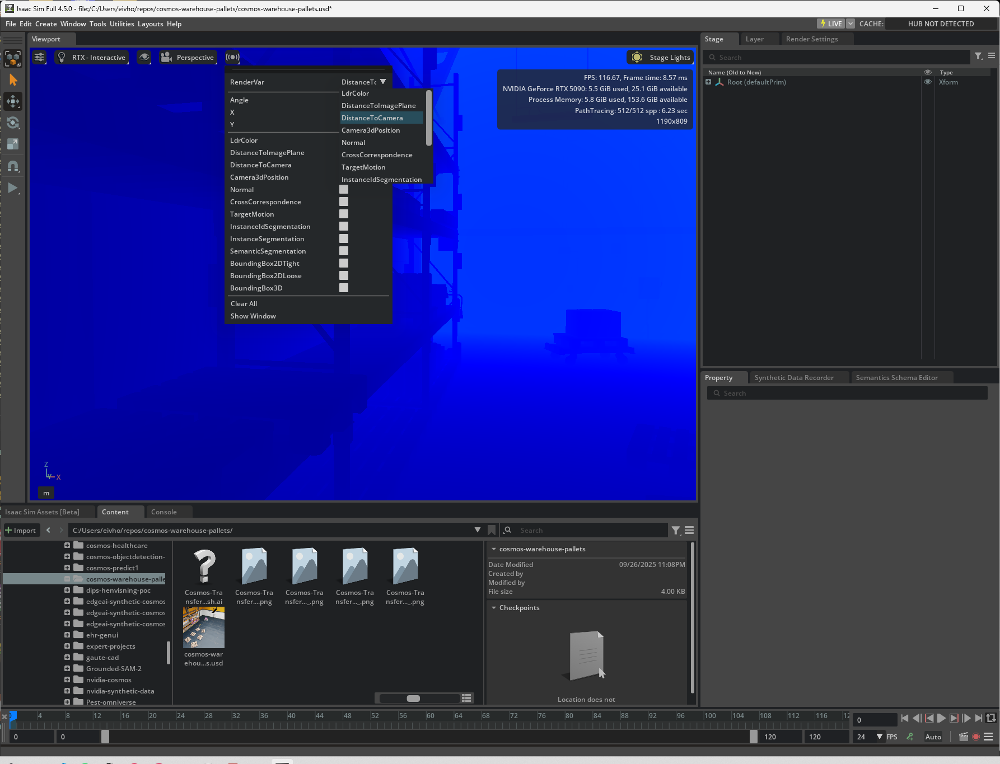

Created By: [Eivind Holt](www.linkedin.com/in/eivholt)

GitHub Repo: [https://github.com/eivholt/edgeai-synthetic-cosmos-transfer](https://github.com/eivholt/edgeai-synthetic-cosmos-transfer)


# Creating labeled synthetic datasets with Cosmos‑Transfer2.5 + Omniverse
We'll use Cosmos‑Transfer2.5 (2B) to generate physics‑aware videos conditioned by edge/depth/segmentation/blur controls. We’ll start with a hosted Transfer1 demo, then run Transfer2.5 on an 80 GB GPU instance, and finally show how to reuse Omniverse labels by driving Transfer from Isaac Sim modalities.

This is the second installment of tutorials on creating synthetic training images using NVIDIA Cosmos, this time focusing on Cosmos-Transfer and 3D digital twins created in Omniverse.



## Preface
NVIDIA has released a family of World Foundation Models (WFMs) under the umbrella of Cosmos. Each model is designed for specific tasks but also shares capabilities with others, allowing them to complement one another and be combined into streamlined, efficient pipelines. This article focuses on **Cosmos Transfer**. [**Cosmos Predict**](https://docs.edgeimpulse.com/projects/expert-network/nvidia-cosmos-predict2-synthetic-data) and **Cosmos Reason** are covered in separate articles.

- [**Cosmos Reason**](https://github.com/nvidia-cosmos/cosmos-reason1) is capable of reasoning based on spatial and temporal understanding of multimodal input. It can interpret what a sensor is seeing and predict consequences. It can also be a helpful tool to automatically evaluate the quality of synthetic training data.
- [**Cosmos Predict**](https://github.com/nvidia-cosmos/cosmos-predict2) can create training data, both single image and video clip, for visual AI based on text- and image input.
- [**Cosmos Transfer**](https://github.com/nvidia-cosmos/Cosmos-Transfer2.5) can amplify creation of variations of environment and lighting conditions for training data for visual AI. Multiple input signals enable control of physics-aware world generation. We can compose a 3D scene in NVIDIA Omniverse Isaac Sim and have Cosmos Transfer create the variation needed to train robust models for visual computing.

All models are pre-trained for autonomous vehicle and robotic scenarios, and support post-training for specific use cases.

## Prerequisites
- Python
- Linux environment, Windows Subsystem for Linux, WSL2 works
- Access to NVIDIA GPU with at least 80 GB VRAM
- NVIDIA Omniverse Isaac Sim

## What to expect
This tutorial shows how to use [**NVIDIA Cosmos-Transfer2.5**](https://github.com/nvidia-cosmos/Cosmos-Transfer2.5), released October 2025 to generate physics aware synthetic images for training models for visual computing. The tutorial will walk through methods to compose 3D representations of what we want to recognize, generate infinite variation, reuse label data objects of interest and prepare data for model training in [Edge Impulse Studio](https://edgeimpulse.com/).

First, we'll compare Transfer to other models to identify its novel features. Then we'll walk through an accessible web demo. The rest of the article will demonstrate hands-on how to use Transfer.

Transfer2.5 prefers control videos at 1280×720 and clips whose length is a multiple of 93 frames.

## NVIDIA Cosmos-Transfer unique features
Generative diffusion models, such as **NVIDIA Cosmos-Predict**, **OpenAI Sora** or **Google Gemini Veo** have opened up a whole new set of possibilities for creating training images and videos for computer vision. Where they come short however, is in object labeling. We can use Open Vocabulary Object-Detection (OVD) for automatic labeling of common objects, but for uncommon objects we are left with labor intensive manual bounding box categorization.

On the other hand we can compose our scenes and objects in 3D graph tools such as NVIDIA Omniverse Isaac Sim, and use [domain randomization](https://docs.edgeimpulse.com/projects/expert-network/rooftop-ice-synthetic-data-omniverse) to render photo realistic stills or video clips. Using Replicator toolkit, we can annotate semantics to obtain pixel‑accurate labels. Creating a great degree of variation in scenes can involve a lot of work. For instance, creating a traffic scene with moving cars in Omniverse is well within reach. Simulating all kinds of weather, lighting conditions, blowing leaves, pedestrian density etc. can become overwhelming.

Cosmos-Transfer enables the best of both worlds - we can model and control the important aspects of our training data and use generative AI to fill in and randomize the rest. Since our controlling input can be automatically perfectly labeled, the label data remains valid for all our varied output.

[](https://youtube.com/shorts/AAwPAni6hjw)

## Testing Transfer online
At [build.nvidia.com](https://build.nvidia.com/nvidia/cosmos-transfer1-7b) we can test an earlier version, Transfer1‑7B. Simply select a scenario and generate a new variation based on a supplied or custom prompt. Notice how a simulated 3D animation is transferred to a realistic looking video clip.



## Running Transfer2.5 on a GPU farm
Let's take Transfer for a spin. Unfortunately, Transfer2.5 does not run on anything that can be considered a "home GPU". As Cosmos-Transfer2-2B is rated with a 65.4 GB VRAM requirement, finding a GPU service with 80 GB per instance or more is recommended. [Lambda Cloud](https://lambda.ai/service/gpu-cloud) currently charges $2.49/hr for a single H100 (80 GB PCIe), a great starting point.

Installing Cosmos Transfer2.5 as a container is highly recommended as wrangling versions of CUDA, GPU drivers, Torch etc can be tricky. Make sure to have at least 100GB of available storage. Follow the provided [installation instructions](https://github.com/nvidia-cosmos/cosmos-transfer2.5/blob/main/docs/setup.md) to:

* Clone the repo
* Build the container
* Launch container with proper access to local files
* Obtain model access at HuggingFace
* Download Cosmos model weights on first run

In effect
```bash
# To see system resources in web UI, download and run the Lambda agent.
curl -L https://lambdalabs-guest-agent.s3.us-west-2.amazonaws.com/scripts/install.sh | sudo bash

# Clone Transfer2.5
git clone git@github.com:nvidia-cosmos/cosmos-transfer2.5.git
cd cosmos-transfer2.5

# We need to add our default Lambda Ubuntu user to docker for permissions.
sudo usermod -aG docker $USER
newgrp docker

# Build docker container
docker build --ulimit nofile=131071:131071 -f Dockerfile . -t cosmos-transfer-2.5

# Preserve model checkpoints to Lambda Cloud Storage
# Find your storage
df -h | grep /lambda/nfs
ls -lah /lambda/nfs/[storage]

# Prepare folder
sudo chmod -R 777 /lambda/nfs/[storage]

# Export location
FS=/lambda/nfs/[storage]

docker run --gpus all --rm -v .:/workspace -v /workspace/.venv \
  -v "$(pwd)":/workspace \
  -v "$FS":/cosmos \
  -e HF_HOME=/cosmos/hf \
  -e HF_HUB_CACHE=/cosmos/hf/hub \
  -e TRANSFORMERS_CACHE=/cosmos/hf/transformers \
  -e XDG_CACHE_HOME=/cosmos \
  -e TORCH_HOME=/cosmos/torch \
  -e CHECKPOINT_DIR=/cosmos/checkpoints \
  -it cosmos-transfer-2.5

# Without checkpoint preservation
docker run --gpus all --rm -v .:/workspace -v /workspace/.venv -it cosmos-transfer-2.5

# Create an API token at HuggingFace and apply for access to Cosmos-Predict2.5-2B model https://huggingface.co/nvidia/Cosmos-Predict2.5-2B
hf auth login

# Test environment dependecies
python scripts/test_environment.py
```

Should you run into `RuntimeError: FlashAttention only supports Ampere GPUs or newer.` try upgrading flash-attn:
```bash
python -m pip install -U pip wheel setuptools
python -m pip install -U --pre flash-attn
```

In the Transfer2.5 repo we can find some clues as to what toggles are at our disposal in `cosmos_transfer2/config.py`:
```python
video_path = Path(default="")
image_context_path = String(default=None)
prompt = String(default=None)
prompt_path = String(default="")
negative_prompt = String(default=DEFAULT_NEGATIVE_PROMPT)
output_dir = String(default="outputs/")

seed = Int(default=2025)
resolution = String(default="720")
guidance = Int(default=3)
control_weight = Float(default=1.0, min=0.0, max=1.0, step=0.01)
sigma_max = String(default=None)
show_control_condition = Bool(default=False)
show_input = Bool(default=False)
not_keep_input_resolution = Bool(default=False)
offload_guardrail_models = Bool(default=False)

edge = Dict(default={})
vis = Dict(default={})
depth = Dict(default={})
seg = Dict(default={})
```

In the Cosmos-Transfer2.5 pipeline we find implementations that can perform a few types of coversions of our input video. In the following example we'll provide a video clip as input. The clip looks like a normal RGB video, but we'll only let the model see the edges of the objects in the scene. If we use Cosmos Predict, we can create a video clip purely generated from a text prompt. The model, a diffusion model, is free to generate whatever scene it semantically associates with the input prompt. With Cosmos Predict we are given the option to provide the initial frame to steer the video clip generation to some extent, but still we maintain little control over how the geometric aspects of the scene develops. Cosmos Transfer, however, is unique in that we can accompany the text prompt with a range of control data. In the following example we'll see how we can make sure reimagined versions of an original clip maintains geometric shapes, while leaving the "coloring-in" to the diffusion model. This is an over-simplification, but a practical way to think of how we can use it in data augmentation.

[Find an appropriate video clip](https://pixabay.com/videos/robot-machine-work-company-88223/), preferably in the domain of robotics, industrial or automotive, not [celebrities eating Italian cusine](https://en.wikipedia.org/wiki/Will_Smith_Eating_Spaghetti_test). The Cosmos Transfer pipeline will take care of converting the input video, in this case edge data. If more control is desired, convert it using `ffmpeg` and reference it in `edge.control_path`. One might have to experiment with the `edgedetect` parameters.

```bash
ffmpeg -i assets/racecars/IMG_0764.MOV \
  -vf "scale=1280:720,fps=24,format=gray,edgedetect=low=0.08:high=0.2" \
  -t 5 \
  -c:v libx264 -crf 18 -preset veryfast -an assets/racecars/IMG_0764.MOV_edges.mp4
```

Then, create a `controlnet_specs.json` file, `racecars_edge_spec.json`:
```json
{
    "prompt": "The video depicts racecars parked in a row in a grass field during a motorsport event. The racecars are sleek, aerodynamic vehicles with vibrant liveries featuring sponsor logos and racing numbers. The scene is set on a sunny day with clear blue skies, and the pitlane is bustling with activity as team members and mechanics prepare the cars for the upcoming race. Surrounding the cars, there are grandstands filled with spectators, adding to the lively atmosphere of the event. The area surrounding the cars is filled with various equipment, spare tires and tools visible, indicating a professional racing environment. Drivers, journalists, camera crews and fans are all present, standing directly behind the cars, some walking in front of the cars. The overall mood of the video conveys excitement and anticipation. The racecars are positioned in a green grass field with, with wheel tracks visible in the dirt, suggesting previous racing action. The field shows signs of wear from many passing cars. The video captures the essence of motorsport culture, allowing fans to get close to the action and experience the thrill of racing.",
    "output_dir": "outputs/racecars/racecars_dirt1",
    "video_path" : "assets/racecars/IMG_0764.MOV",
    "guidance": 7,
    "edge": {
        "control_weight": 1.0
      },
    "seed": 1
}
```
In the container shell run:
```bash
python examples/inference.py --params_file assets/racecars/racecars_edge_spec.json
```

Expect to spend some time experimenting with `guidance` and `control_weight` for each case.



Note: Transfer2.5 currently doesn't document any 4k upscaling capability. As a fallback, Transfer1 does provide this, as described at the end of the article.

## Preserving labels by combining Omniverse Isaac Sim digital twins with Transfer
One of the great upshots of Transfer's ability to control scene composition using control nets, is that we can make object labels, i.e. bounding boxes, valid even when we generate visual variations, as long as Transfer stays aligned to the rendered geometry. For regular video clips used as input, containing common objects, we can either label our objects of interest manually, or we can use Open Vocabulary Object-Detection (OVD) pipelines, such as [**Grounding DINO 1.5**](https://github.com/IDEA-Research/Grounding-DINO-1.5-API) with [**Grounded Segment Anything 2**](https://github.com/IDEA-Research/Grounded-SAM-2).

Open Vocabulary Object-Detection works great for common objects that the model in question has been trained on. If we want to train a model to detect novel object however, our best option is to model a rough 3D representation and create a number of animations. We don't strictly need movement or animations to train object detection models, but movement is a great way to capture different angles of our objects of interest. Another option would be to capture an animation where we randomly scatter the objects, lights, camera angles. This doesn't work well with Cosmos as it quickly loses object continuity over time.

### Rendering a labeled animation in Isaac Sim
We'll generate a 5‑second 720p clip using Transfer2.5 conditioned on edge (and optionally depth/seg) derived from an Isaac Sim scene, then reuse labels from the CG twin. For a quick start, install Omniverse Isaac Sim and load one of the sample scenes, e.g. `Isaac Sim Assets/Environments/Simple_Warehouse/warehouse`. This will provide some nice 3D models that are already labeled. To edit animation, semantics and capture video, a few extensions must first be enabled, use the search field in Extensions.





All we need to do is to animate the camera using key frame animations. Select the camera, go to `Animation/Curve Editor`. Set end frame = 120 to limit our animation to 5 seconds of 24 fps. To be able to animate camera orientation, right click `Transform/Orientation` and select `Disable`. At frame 0, click the icon of a green key and a plus symbol. This captures the current camera transformation. Then, jump to the end frame, 120, move the camera as desired and once again click the green key and plus symbol. Jumping back and forth in the timeline should interpolate the camera transformation between start and stop. 



Inspect a random pallet (select the Mesh node in the hierarchy, not the top-most Xform), go to `Semantics Schema Editor` and look at the Semantics data of type `class`.



Go to `Window/Rendering/Movie Capture`, select the animated camera, make sure end is set to 120, set Transfer2.5s preferred resolution of 1280 x 720 (1280 x 704 for Transfer1) and select .mp4 output. This will render an animation clip. For higher fidelity render to still images and combine to a video clip with `ffmpeg` or similar.



### Create infinite variations of the animation using Transfer
As before, create a `controlnet_specs.json` file, `warehouse-pallet_edge_spec.json`:
```json
{
    "prompt": "The video is set in a worn-down warehouse. The main focus is on pallets on the worn and dirty concrete floor and on shelves. The warehouse shows clear signs of wear and tear.",
    "output_dir": "outputs/warehouse-pallet/warehouse-pallet-dirty_seed1",
    "video_path" : "assets/warehouse-pallet/warehouse-pallet-anim-transfer.mp4",
    "guidance": 7,
    "edge": {
        "control_weight": 1.0
      },
    "seed": 1
}
```
In the container shell run:
```bash
python examples/inference.py --params_file assets/warehouse-pallet/warehouse-pallet_edge_spec.json
```

Experiment with different prompts, increment seed or adjust parameters such as `guidance` and `control_weight` and observe the differences in outputs.



### Custom 3D scene and alternative control data modalities
To build a 3D scene from scratch and add semantic data, look at this [tutorial](https://docs.edgeimpulse.com/projects/expert-network/surgery-inventory-synthetic-data#solution-overview). A few things have changed in Omniverse, just use Isaac Sim in place of Omniverse Code.

This will also show how to generate and convert bounding box label data for upload to [Edge Impulse Studio](https://studio.edgeimpulse.com/). The label data remains reusable for any variation created with Transfer, just extract still frames from video clips using `ffmpeg` and align file names.

Example `controlnet_specs.json` file:

```json
{
    "prompt": "The video is set in a surgery room. The main focus is on a table with surgical equipment, scalpels, forceps, gauze swabs, tweezers, scissors, beakers, bowls. Surgical tools and containers are chrome not glass, swabs are white cotton. The surgical equipment is laid out on top of sterile drapes. All table surfaces are covered with light blue sterile cloth. The scene is well-lit, highlighting the sterile environment typical of a medical setting. The background includes medical monitors and cabinets filled with supplies, emphasizing the clinical atmosphere. The surgical equipment and table cloth are visibly used, showing signs of wear and tear, adding authenticity to the scene.",
    "output_dir": "outputs/surgery/surgery-omniverse-anim-noBG3_seed1",
    "video_path" : "assets/surgery/surgery-omniverse-anim-noBG3.mp4",
    "guidance": 7,
    "edge": {
        "control_weight": 1.0
      },
    "vis": {
        "control_weight": 0.5
      },
    "seed": 1
}
```


### Rendering custom control data
When rendering rgb videos from Isaac Sim, we also have the option of rendering other modalities of our animation. These can be fed into Transfer, in place of having these computed based on the rgb video signals. Find the elusive `Sensory` button, to the right of the menu for selecting viewport. In the immediate menu that appears one can select multiple render types, but this only opens in secondary windows. Hit the mysterious `RenderVar` to change the default viewport render type, e.g. to render depth(DistanceToCamera), label class segmentation (SemanticSegmentation), unique object segmentation (InstanceIdSegmentation). Then re-render the animation and configure `controlnet_specs.json` to adhere to the provided extra video clips, instead of computing these modalities.





```json
{
    "prompt": "The video is set in a worn-down warehouse. The main focus is on pallets on the worn and dirty concrete floor and on shelves. The warehouse shows clear signs of wear and tear.",
    "output_dir": "outputs/warehouse-pallet/warehouse-pallet-dirty_seed1",
    "video_path" : "assets/warehouse-pallet/warehouse-pallet-anim-transfer.mp4",
    "depth": {
        "control_path": "assets/warehouse-pallet/warehouse-pallet-anim-transfer_depth.mp4"
      },
    "seg": {
        "control_path": "assets/warehouse-pallet/warehouse-pallet-anim-transfer_seg.mp4"
      }
}
```

## Running *Transfer1* locally
Following is a description of running inference using the older *Transfer1* on a RTX 5090 with 32 GB VRAM. We'll test it with a single modality control, and a prompt. That is, we'll only provide one form of input to steer the generated video frames, in addition to the text prompt.

Again, installing Cosmos Transfer1 as a container is highly recommended as wrangling versions of CUDA, GPU drivers, Torch etc can be tricky. Make sure to have at least 400GB of available storage. Follow the provided [installation instructions](https://github.com/nvidia-cosmos/cosmos-transfer1/blob/main/INSTALL.md) to:

* Clone the repo
* Build the container
* Launch container with proper access to local files
* Obtain model access at HuggingFace
* Download Cosmos model weights

```bash
# Clone Transfer1 repo and all submodules
git clone git@github.com:nvidia-cosmos/cosmos-transfer1.git
cd cosmos-transfer1
git submodule update --init --recursive

# Build container
docker build -f Dockerfile . -t nvcr.io/$USER/cosmos-transfer1:latest

[Start your Docker host]

# Download models checkpoints
# Create an API token at HuggingFace and apply for access to Cosmos-Predict2.5-2B model https://huggingface.co/nvidia/Cosmos-Predict2.5-2B
hf auth login
PYTHONPATH=$(pwd) python scripts/download_checkpoints.py --output_dir checkpoints/

# Run container with reference to model checkpoints
sudo docker run --gpus all -it --rm -v "$(pwd)":/workspace -v "$(pwd)/datasets":/workspace/datasets -v "$(pwd)/checkpoints":/workspace/checkpoints nvcr.io/[user]/Cosmos-Transfer1
```

Then, running scripts/test_environment.py should produce the following:
```bash
[SUCCESS] torch found
[SUCCESS] torchvision found
[SUCCESS] transformers found
[SUCCESS] megatron.core found
[SUCCESS] transformer_engine found
INFO 08-28 17:44:52 [__init__.py:256] Automatically detected platform cuda.
[SUCCESS] vllm found
[SUCCESS] pandas found
-----------------------------------------------------------
[SUCCESS] Cosmos environment setup is successful!
```

In Transfer1, pipelines were a bit different. The following is an example of running single control input (edge):

First, for single GPU inference, set some environment variables:
```bash
export CUDA_VISIBLE_DEVICES="${CUDA_VISIBLE_DEVICES:=0}"
export CHECKPOINT_DIR="${CHECKPOINT_DIR:=./checkpoints}"
export NUM_GPU="${NUM_GPU:=1}"
```

Then, for inference run:
```bash
PYTHONPATH=$(pwd) torchrun --nproc_per_node=$NUM_GPU --nnodes=1 --node_rank=0 cosmos_transfer1/diffusion/inference/transfer.py     --checkpoint_dir $CHECKPOINT_DIR     --video_save_folder outputs/hardhat_single_control_edge_seed1     --controlnet_specs assets/inference_cosmos_transfer1_hardhat_single_control_edge.json     --offload_text_encoder_model     --offload_guardrail_models     --offload_diffusion_transformer     --offload_prompt_upsampler --use_distilled    --num_gpus $NUM_GPU --seed 1
```

`inference_cosmos_transfer1_hardhat_single_control_edge.json` looks like this:
```json
{
    "prompt": "The video is set in on a construction site. The environment depicts many construction workers  in high visibility gear and hard hats. The workers are pouring concrete into framework with rebar already in place. It is raining heavily, it's nighttime, the work area is illuminated by flood lights. The main focus is on workers pouring concrete.",
    "input_video_path" : "assets/20109885-hd_1280_720_25fps.mp4",
    "edge": {
        "control_weight": 1.0
    }
}
```



# Conclusion
These are the basic features of Transfer, enabling us to create infinite variations of training data for computer vision. Many more advanced features can be explored in the documentation, such as multi-view output, HD map control input and multimodal control with spatiotemporal control maps.

# Appendix
## Converting output video clips to a color space more suitable for video editing software
Some NLEs expect Rec. 709 TV‑range; this recipe avoids washed‑out previews.
```bash
ffmpeg -i input.mp4 -vf "zscale=matrix=bt709:transfer=bt709:primaries=bt709,scale=in_range=full:out_range=tv" \
-c:v libx264 -pix_fmt yuv420p -crf 10 -preset slow \
-color_primaries bt709 -color_trc bt709 -colorspace bt709 -c:a copy output_rec709_tvrange.mp4
```

## Upscaling clips to 4K with Transfer1
```bash
PYTHONPATH=$(pwd) torchrun --nproc_per_node=$NUM_GPU --nnodes=1 --node_rank=0 cosmos_transfer1/diffusion/inference/transfer.py     --checkpoint_dir $CHECKPOINT_DIR     --video_save_folder outputs/surgery_single_control_edge_upscaled_8     --controlnet_specs assets/inference_upscaler.json     --num_steps 10     --offload_text_encoder_model --offload_guardrail_models --offload_prompt_upsampler   --num_gpus $NUM_GPU
```

Cosmos models are under the [NVIDIA Open Model License](https://www.nvidia.com/en-us/agreements/enterprise-software/nvidia-open-model-license/); do not bypass guardrails.